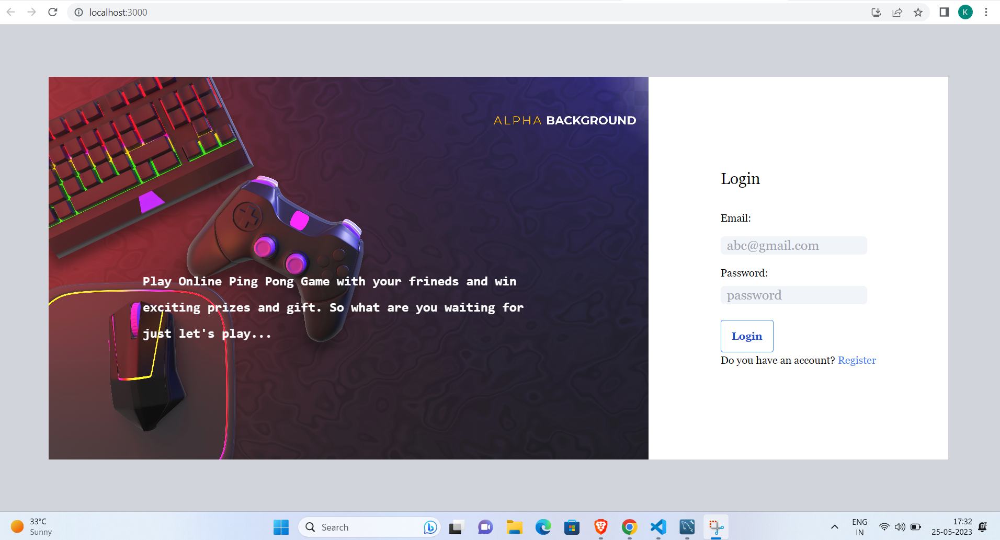
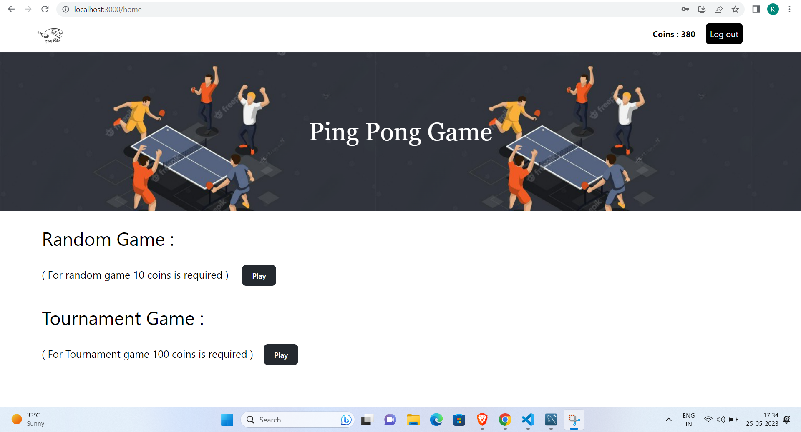
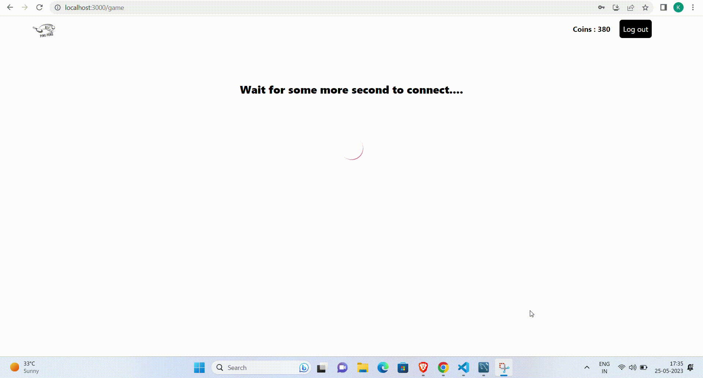
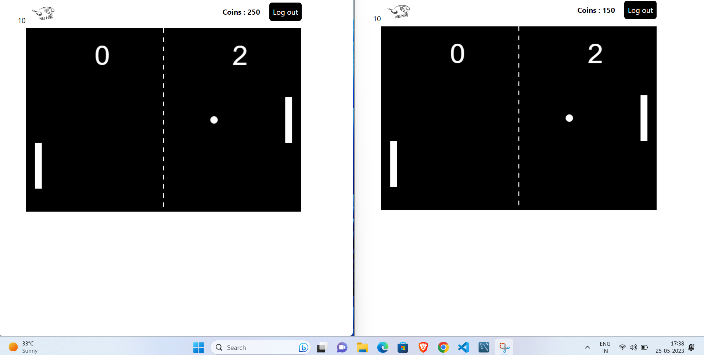
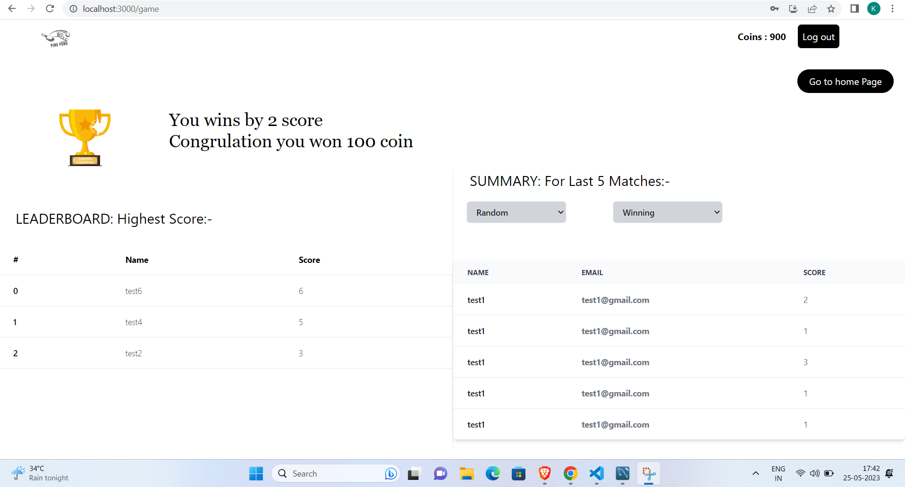

# Online Gaming Platform


#### This is an online gaming platform in which you can play ping pong game. In which you have a two option either you can join random league and tournament league. In random league it will take a charge of 10 coin to play and in case of tournament it will take 100 coin as an entry fee. And both these league you will connecting to random player in the world and play a game with him/her. After winning a league you will get some coins as a winning prize and you can also see the last 5 match summary, higest score of the particular league.

















## Technology Stack Used

 


 
 
 
 


- Front End - **React Js**, **Typescript**, **Tailwind CSS**, **JavaScript**
- Back End - **Node Js**
- Database - **MySql**
- Testing -  **Jest**
- Framework - **Docker**


## Installing 

[](https://hub.docker.com/_/docker)

- Download [DOCKER](https://hub.docker.com/_/docker)


## How to run?

1. Download [this](https://github.com/kshitij1410/Online-Gaming-Platform) repo and extract it in your directory. 

2. Run this command on terminal `docker-compose up`.

3. Before running this command make sure you have docker desktop software install in your pc. 


## Need help?

```javascript

  if (needHelp === true) {
     var emailId = "kshitijkhandelwal14.2000@gmail.com";
     // email is the best way to reach out to me.
     sendEmail(emailId);
  }

```

Invite me to connect on [LinkedIn](https://www.linkedin.com/in/kshitij-khandelwal-716b741b2/).


## Author

Kshitij Khandelwal


## Oh, Thanks!

```bash


 _____ _                 _     __   __            
|_   _| |               | |    \ \ / /            
  | | | |__   __ _ _ __ | | __  \ V /___  _   _   
  | | | '_ \ / _` | '_ \| |/ /   \ // _ \| | | |  
  | | | | | | (_| | | | |   <    | | (_) | |_| |  
  \_/ |_| |_|\__,_|_| |_|_|\_\   \_/\___/ \__,_|  
                                                  
                                                  
______                                            
|  ___|                                           
| |_ ___  _ __                                    
|  _/ _ \| '__|                                   
| || (_) | |                                      
\_| \___/|_|                                      
                                                  
                                                  
______      _               _   _               _ 
| ___ \    (_)             | | | |             | |
| |_/ / ___ _ _ __   __ _  | |_| | ___ _ __ ___| |
| ___ \/ _ \ | '_ \ / _` | |  _  |/ _ \ '__/ _ \ |
| |_/ /  __/ | | | | (_| | | | | |  __/ | |  __/_|
\____/ \___|_|_| |_|\__, | \_| |_/\___|_|  \___(_)
                     __/ |                        
                    |___/                         

 


```
